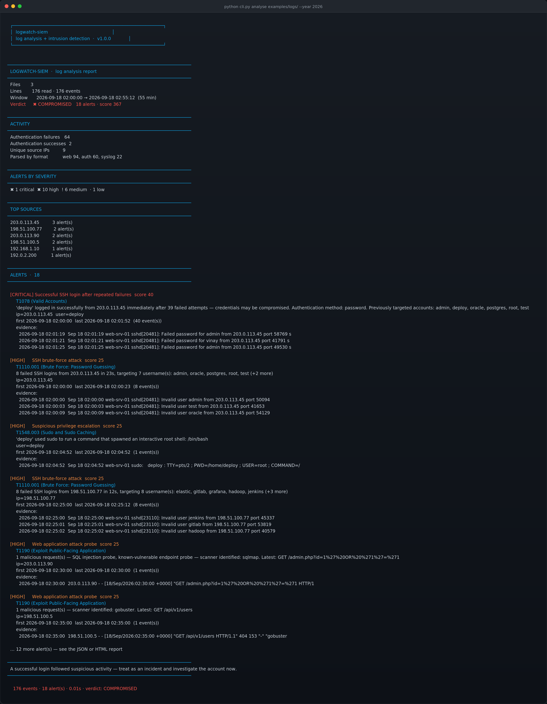

# 🛡️ logwatch-siem

A **log analysis and intrusion detection tool** built from scratch in Python. Parses Linux auth logs, syslog, kernel firewall logs and web access logs, then correlates events across time windows to detect brute force, credential compromise, privilege escalation, persistence and web attacks.

> **Source code is private.** This repository is the public showcase: architecture, detection results and sample reports. Happy to walk through the implementation in an interview or on a call.

<p align="left">
  
  
  
  
  
  
</p>

---

## 🎯 Why this exists

A single failed SSH login is noise. Forty from one IP in two minutes is an attack. **A successful login right after those forty is a breach.** None of that is visible in one log line — it only exists across time, across sources, which is exactly why grep doesn't solve this problem.

This tool normalises every log format into one event shape, then runs stateful rules over a time-ordered stream. It's the third in a series:

| | Project | Focus |
| :--- | :--- | :--- |
| 1 | [**signature-scanner**](https://github.com/vinaynayak2007/signature-scanner) | Detect files by hash and behaviour |
| 2 | [**pe-analyzer**](https://github.com/vinaynayak2007/pe-analyzer) | Open executables up and look inside |
| 3 | **logwatch-siem** | Catch attacks happening on a running host |

---

## 📸 It running

18 alerts across a 55-minute window, verdict **COMPROMISED**:



**Full HTML report:** [`sample-report.html`](sample-report.html) · **Raw JSON:** [`sample-report.json`](sample-report.json)

---

## 🚨 The alert that matters

Most tools stop at "brute force detected". The one that actually matters is the **success**:

```
[CRITICAL] Successful SSH login after repeated failures        score 40
    T1078 (Valid Accounts)
    'deploy' logged in successfully from 203.0.113.45 immediately
    after 39 failed attempts — credentials may be compromised.
    Authentication method: password.
    Previously targeted accounts: admin, deploy, oracle, postgres, root, test
```

Everything else here is a warning. That one is an incident. It's why the tool exits **`2`** to distinguish "compromise" from **`1`** ("something found") and **`0`** ("clean") — so a cron job or CI pipeline can page on the difference.

---

## 🧠 Detection rules

15 rules, each mapped to a MITRE ATT&CK technique.

### Stateful — the interesting ones

| Rule | Severity | What it correlates |
| :--- | :--- | :--- |
| `successful_login_after_failures` | **critical** | A success following N failures from the same IP — **the compromise signal** |
| `ssh_brute_force` | high | ≥8 failures from one IP in 5 min, with per-IP cooldown |
| `distributed_brute_force` | high | Failures from ≥5 IPs — **per-IP thresholds miss this entirely; botnets rely on it** |
| `user_enumeration` | medium | Failures across ≥5 *nonexistent* accounts — recon, not guessing |
| `web_attack_probe` | high | Injection/traversal probes + known scanner user agents |
| `directory_scanning` | medium | A burst of 404s from one source — content discovery |
| `web_login_brute_force` | high | Repeated failed web logins |
| `port_scan_by_drops` | medium | Firewall drops to ≥15 *distinct ports* — infers recon without an explicit label |
| `high_request_rate` | medium | Sustained request volume — scraping or DoS |

### Stateless

| Rule | Severity | What it catches |
| :--- | :--- | :--- |
| `root_login` | high | Direct root SSH — policy violation in most environments |
| `suspicious_sudo` | high | 13 regexes for dangerous escalation (`bash`, `chmod 777`, `visudo`, `curl \| bash`, `dd of=/dev/`, `iptables -F`…) |
| `repeated_sudo_failures` | medium | Someone probing for a password |
| `account_created` | medium | New local account — persistence (T1136.001) |
| `firewall_port_scan` | medium | Firewall explicitly labels a port scan |
| `password_changed` | low | Account manipulation |

**Every alert carries its evidence** — the actual log lines, the timestamp of each, first/last seen, and the MITRE technique. An alert an analyst can't verify is an alert they'll ignore.

---

## 🎯 What it detected in the sample logs

176 log lines, 55-minute window, **18 alerts**:

| Severity | Finding |
| :--- | :--- |
| ✖ **critical** | `deploy` logged in after 39 failed attempts — compromise |
| ✖ high | SSH brute force from `203.0.113.45` (8 failures / 23s, 7 usernames) |
| ✖ high | SSH brute force from `198.51.100.77` (8 failures / 12s) |
| ✖ high | `deploy` used sudo to spawn an interactive root shell |
| ✖ high | `vinay` sudo → `visudo`, `chmod 777`, and `curl \| bash` |
| ✖ high | sqlmap SQL-injection campaign from `203.0.113.90` |
| ✖ high | gobuster directory scan identified by user agent |
| ✖ high | Direct root login from `192.168.1.10` |
| ✖ high | 10 failed web logins against `/admin/login` |
| ! medium | 20 requests for nonexistent paths (`/.env`, `/.git/config`, `/.aws/credentials`) |
| ! medium | `192.0.2.200` probed 15 distinct ports in 8s |
| ! medium | Username enumeration from two separate sources |
| ! medium | Account `backupsvc` created, then password set — persistence chain |

---

## 🔧 Design decisions

**Sliding windows with bounded memory.** `Window` evicts events older than its span and caps its deque. A naive implementation that appends forever is exactly what makes log tools fall over on real files.

**Events are sorted before analysis.** Log files are frequently *not* in order — rotated files concatenated, multiple sources merged, container logs interleaved. Every windowed rule silently produces wrong answers on out-of-order input, so sorting once up front is cheap insurance.

**One alert per window, not one per threshold multiple.** My first version fired enumeration alerts at 5 users *and again* at 10 — reading as two incidents when it was one. Cooldowns now suppress the repeat. There's a regression test for it.

**Parsing is separate from detection.** Rules never see a regex. A brute-force rule shouldn't care whether failures came from `auth.log` or a JSON stream — only that they were failures, from one IP, in a window.

**Syslog year rollover.** Syslog timestamps omit the year. Around New Year, a log can contain December lines followed by January ones — a naive parse produces events that jump backwards in time, breaking every windowing rule. The parser detects the rollover and bumps the year. Tested.

**Report HTML escaping.** Log content is attacker-controlled. A username of `<script>alert(1)</script>` must not become markup in the report — tested explicitly.

---

## 📖 Commands

```
analyse <targets…>   run detection ( --html, --json, --only, --threshold, -q )
rules                list all detection rules
events <targets…>    dump parsed events as a table — validate a parser
kinds <targets…>     event-kind distribution
```

```bash
python cli.py analyse /var/log/auth.log
python cli.py analyse /var/log/ --year 2026 --html report.html
python cli.py analyse auth.log --only ssh_brute_force,successful_login_after_failures
python cli.py analyse /var/log/ --threshold 20 -q     # cron-friendly
```

Handles directories, globs and `.gz` rotated archives. **Exit codes:** `0` clean · `1` alerts · `2` compromise.

---

## ✅ Test suite

```
Ran 69 tests in 0.057s
OK
```

Organised by layer: parsers (can I read this format?), windows (does time-based state work?), rules (does it detect the thing?), then end-to-end (does the pipeline hold).

Cases worth calling out:

- **`test_failures_outside_window_do_not_accumulate`** — 5 failures spread one-per-minute must not trigger a 5-in-1-minute rule
- **`test_only_reported_once`** — the same compromise must not alert repeatedly
- **`test_repeated_same_user_is_not_enumeration`** — guessing one account 20 times is brute force, not enumeration
- **`test_distributed_not_triggered_by_single_source`** — 50 failures from one IP is brute force, not *distributed* brute force
- **`test_ordinary_commands_not_flagged`** — `systemctl restart nginx` must stay silent
- **`test_rollover_across_year_boundary`** — Dec 31 → Jan 1 must not go backwards
- **`test_memory_is_bounded`** — 1000 events through a 50-slot window stays ≤50
- **`test_malformed_lines_are_counted_not_fatal`** — garbage lines are counted, never fatal

---

## 📝 Sample logs

`examples/make_logs.py` generates realistic logs covering every rule. **Every IP is from an RFC 5737 documentation range** (`192.0.2.0/24`, `198.51.100.0/24`, `203.0.113.0/24`) or RFC 1918 private space — nothing points at a real host, and the generator is deterministic so results are reproducible.

Scenarios: an SSH brute force that **succeeds** and pivots to persistence · username enumeration · direct root login · dangerous sudo · firewall port scan · sqlmap and gobuster web campaigns · failed web logins.

---

## 🗂️ Architecture

```
cli.py                argparse entrypoint — analyse / rules / events / kinds
lwsiem/
  events.py           normalised Event and Alert models, event-kind constants
  parsers.py          auth.log, syslog/kern.log and web access-log parsers
  rules.py            15 detection rules + the bounded sliding Window
  engine.py           parse → sort → dispatch → rank pipeline
  report.py           terminal, JSON and HTML renderers
```

---

## ⚠️ Limitations — stated honestly

- **Offline analysis.** This reads log files; it does not tail them live. A streaming mode is on the roadmap.
- **Syslog, auth and combined web logs only.** JSON logs, Windows Event Log and journald need their own parsers.
- **Thresholds are defaults, not tuning.** 8 failures in 5 minutes suits a small server; a busy SSH bastion needs different numbers. Every threshold is a CLI option for that reason.
- **Cooldowns trade recall for signal.** A sustained attack produces one alert, not one per packet. That's deliberate — alert floods get muted, and muted alerts detect nothing.
- **Heuristics produce false positives.** A legitimate pentest, a misconfigured cron job and an aggressive scraper all look like attacks here. Correlation and evidence are provided precisely so a human decides.
- **No live enrichment.** No GeoIP, no threat-intel lookup, no IP reputation.
- **Detections are indicators, not proof.** A critical alert means "investigate now", not "confirmed breach".

---

## 🗺️ Roadmap

- [ ] Live tailing mode — monitor a file or journald stream continuously
- [ ] Slack / email / webhook alerting on critical findings
- [ ] JSON and journald parsers
- [ ] GeoIP enrichment for source addresses (MaxMind)
- [ ] Baseline learning — flag deviations from normal traffic per host
- [ ] State persistence so cooldowns survive restarts
- [ ] Sigma rule import for portable detection content
- [ ] Docker image with syslog-forwarding examples

---

## ⚖️ Responsible use

Analyse logs from systems you own or are explicitly authorised to examine. Logs frequently contain personal data — passwords in failed auth lines, usernames, source addresses. Handle exported reports accordingly and don't commit real logs to a repository.

---

## 📄 License

MIT — documentation and sample reports in this repository are free to use and reference.

---

<p align="center"><sub>Built by <a href="https://github.com/vinaynayak2007">Vinay N</a> · Cyber Security @ Alliance University · <a href="https://vinunayak.pages.dev">vinunayak.pages.dev</a></sub></p>
